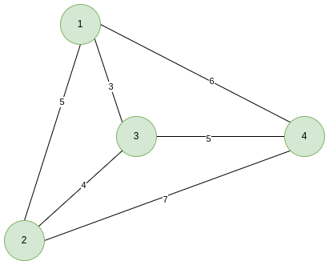
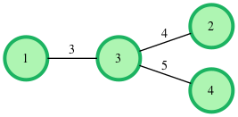
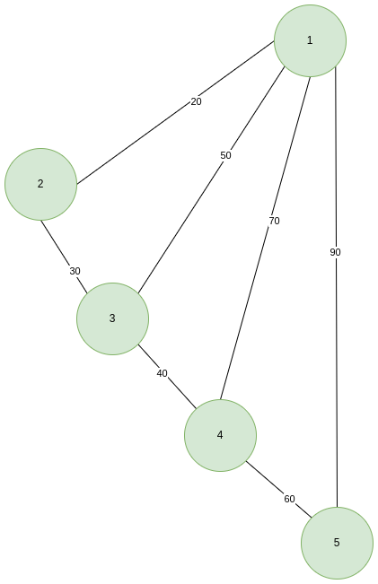

# Kruskal (minimális feszítőfa): igazán különleges részfa - Feladatlap 

## Leírás

Adott egy irányítatlan súlyozott összefüggő gráf, keresd meg benne az igazán különleges részfát. Az igazán különleges részfa egy olyan részgráf, amely a gráf összes csúcsát tartalmazza és:
- csak egy út van egy csúcstól az összes többi csúcsig,
- a részgráf minimális súlyú (az összes él összege) az összes ilyen részgráf között,
- nem tartalmaz kört

Az igazán különleges részfa létrehozásához mindig a legkisebb súlyú élt válaszd ki. Határozd meg, hogy az él hozzávétele létrehoz-e kört. Ha igen, akkor hagyd figyelmen kívül az élt. Ha egyenlő súlyú élek közül választhatsz:
- válaszd ki azt az élt, amely minimalizálja az `u + v + wt` összeget, ahol `u` és `v` csúcsok és `wt` az élsúly;

- ha továbbra is ütközés esete áll fenn, válaszd ezek közül bármelyiket.

Írasd ki a szabályok alapján kialakított fa teljes súlyát.

Például adottak a következő élek:
```
u   v   wt
1   2   2
2   3   3
3   1   5
```
Először válasszuk az `(1,2)` élt `2` súllyal. Majd válasszuk a `(2,3)` élt `3` súllyal. Mind csúcsot tartalmaz a részgráf, és nem tartalmaz kört, a  teljes súly pedig `2+3=5`.

## Függvény leírása

Írdd meg a  `kruskals` függvényt az alábbiak szerint. 

A `kruskals` a következő bemeneti paraméterekkel rendelkezik:

- `g_nodes` : egy egész szám, amely a fa csúcsainak számát jelenti
- `g_from` : egész számok tömbje, amelyek az egyes élek egyik csúcsait jelentik
- `g_to` : egész számok tömbje, amelyek az egyes élek másik csúcsait jelentik
- `g_weight` : egész számok tömbje, amelyek az egyes élek súlyát jelentik

### Visszatérési értéke

- egy egész szám, a kialakított részfa teljes súlya


## Bemenet formátuma

Az első sorban két, szóközzel elválasztott egész szám `g_nodes` és `g_edges` van, melyek rendre a csúcsok és az élek száma a gráfban. A következő `g_edges` sor három, szóközzel elválasztott egész számból áll: `g_from`, `g_to`, és `g_weight`, ahol `g_from` és `g_to` az él által összeköttt két csúcs,  `g_weight` pedig az él súlya.

## Megkötések

- `2 <= g_nodes <= 300`
- `1 <= g_edges <= N*(N-1)/2`
- `1 <= g_from, g_to <= N`
- `0 <= g_weight <= 10^5`

ahol `N>=g_nodes`.

**Megjegyzés:** Ha ugyanazon csúcspár között vannak különböző súlyú élek, akkor azokat többszörös élnek kell tekinteni.

## Kimenet formátuma

Írasd ki az igazán különleges részfa teljes súlyát (egész szám).

## Minta bemenet 1

[](minta1.png)

```
4 6
1 2 5
1 3 3
4 1 6
2 4 7
3 2 4
3 4 5
```

## Minta kimenet 1
```
12
```

## Minta 1 magyarázat

Vegyük a fentebb adott gráfot. Alkalmazzuk Kruskal algoritmusát, rendezzük az éleket súlyuk szerint növekvő sorrendbe.
A rendezést követően a következő élek közül válaszhatunk:

`1->3(w=3)`, `2->3(w=4)`, `1->2(w=4)`, `3->4(w=5)`, `1->4(w=6)`, és `2->4(w=7)`.

Kiválasztjuk az `1->3(w=3)` élt, mivel annak van a legkisebb súlya és hozzávétele az eddigi élekhez nem okoz kört. Ezután hozzávesszük a `2->3(w=4)` élt, mivel annak van a legkisebb súlya a maradék élek közül, és annak az élnek a hozzávétele sem okoz kört. Az `1->2(w=4)` él hozzávétele kört eredményezne, így nem foglalkozunk vele tovább. Kiválasztjuk a `3->4(w=5)` élt, és így megkapjuk a minimális feszítőfát, melynek teljes súlya `3+4+5=12`.




## Minta bemenet 2

[](minta2.png)

```
5 7
1 2 20
1 3 50
1 4 70
1 5 90
2 3 30
3 4 40
4 5 60
```

## Minta kimenet 2

```
150
```

## Minta 2 magyarázat

Adott a fentebbi gráf, kiválasztjuk az `1->2`, `2->3`, `3->4`, `4->5` éleket, ezek súlya összesen `20+30+40+60=150`.

## Forrás
[HackerRank - Kruskal (MST): Really Special Subtree](https://www.hackerrank.com/challenges/kruskalmstrsub/problem)